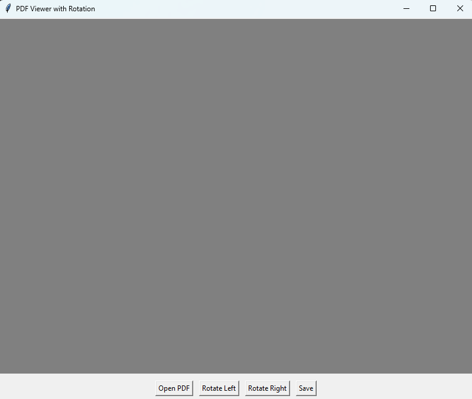

# PDFRotator

A simple PDF viewer with the ability to preview pages, rotate them, and save the changes. Built using Python with `tkinter` for the graphical user interface and `PyMuPDF` (`fitz`) for PDF manipulation. This tool is perfect for quick edits and previews of PDF documents.

## Features

- **Preview PDF Pages**: Displays a scaled-down preview of the current page.
- **Rotate Pages**: Rotate the currently displayed page 90° clockwise or counterclockwise.
- **Save Changes**: Save the rotated PDF to a new file.
- **User-Friendly Interface**: Simple and intuitive GUI for seamless interaction.

## Requirements

To run this application, ensure the following Python libraries are installed:

- `tkinter` (comes pre-installed with Python)
- `PyMuPDF` (`fitz`)
- `Pillow`

Install missing libraries with:
```bash
pip install PyMuPDF Pillow
```

## How to Use

1. Clone or Download the Repository:

```bash
git clone https://github.com/your-username/pdf-viewer.git
cd pdf-viewer
```
2. Run the Script:

```bash
python pdf_viewer.py
```

3. Open a PDF:

Click the "Open PDF" button and select a PDF file.
Rotate Pages:

4. Use "Rotate Left" or "Rotate Right" to adjust the page orientation.
Save Changes:

5. Click "Save", choose a location, and save the PDF with the new rotations.

## Interface
The application interface contains:

A canvas for displaying the current page preview.
Buttons for:
Opening a PDF
Rotating the page left or right
Saving the PDF
Example Interface



## Technical Details
Scaling: The PDF preview is scaled to fit within 800x600 pixels while maintaining the aspect ratio.
PDF Manipulation: Uses PyMuPDF to handle PDF rendering and page rotation.
Image Rendering: Converts PDF pages into images with Pillow for display in the tkinter canvas.

## Development
Contributions are welcome! If you have suggestions for features or improvements, feel free to open an issue or submit a pull request.

## To-Do
Add page navigation (next/previous).
Support for zooming in/out on the preview.
Enhanced error handling for invalid PDFs.

## License
This project is licensed under the GPL3 License.